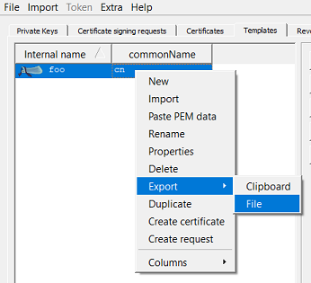

<!-- markdownlint-disable  MD013 -->
# xca_template_parser

`xca_template_helper.py` can be used to decode certificate templates used by [XCA](https://github.com/chris2511/xca) which is ag great tool to manage the certificates for home and small enterprise networks.

[XCA templates](https://www.hohnstaedt.de/xca/index.php/documentation/manual) are stored in a proprietary format. I tried to reverse-engineer the format as my [request for documentation](https://github.com/chris2511/xca/issues/197) has unfortunately not been answered.

## Usage

Before running the tool you need to export the template into a file.



After export you can run the parse to get the details.

```bash
grindsa@ub18-04:~$ py ./xca_template_parser.py example/example.xca
```

The script will print two dictionaries on std-out:

- a list of dn attributes taken from the template
- a list of certificate attributes and extensions

```python
# DN attributes
{'commonName': 'cn',
 'countryName': 'co',
 'localityName': 'locality',
 'organizationName': 'organization',
 'organizationalUnitName': 'ou',
 'stateOrProvinceName': 'state'}

# certificate extensions and attributes
{'adv_ext': None,
 'authInfAcc': None,
 'authKey': '1',
 'basicPath': None,
 'bcCritical': '1',
 'ca': '2',
 'crlDist': 'URI:http://foo.bar',
 'eKeyUse': 'serverAuth, clientAuth, ipsecEndSystem, ipsecTunnel, ipsecUser',
 'ekuCritical': '1',
 'issAltName': None,
 'keyUse': '3',
 'kuCritical': '1',
 'noWellDefinedExpDate': '0',
 'nsBaseUrl': None,
 'nsCARevocationUrl': None,
 'nsCaPolicyUrl': None,
 'nsCertType': '5',
 'nsComment': 'xca certificate',
 'nsRenewalUrl': None,
 'nsRevocationUrl': None,
 'nsSslServerName': None,
 'subAltName': None,
 'subKey': '1',
 'validM': '1',
 'validMidn': '0',
 'validN': '1'}
```

## Contributing

Please read [CONTRIBUTING.md](CONTRIBUTING.md) for details on my code of
conduct, and the process for submitting pull requests.
Please note that I have a life besides programming. Thus, expect a delay
in answering.

## Versioning

I use [SemVer](http://semver.org/) for versioning. For the versions available,
see the [tags on this repository](https://github.com/grindsa/dkb-robo/tags).

## License

This project is licensed under the GPLv3 - see the [LICENSE](LICENSE) file for details
